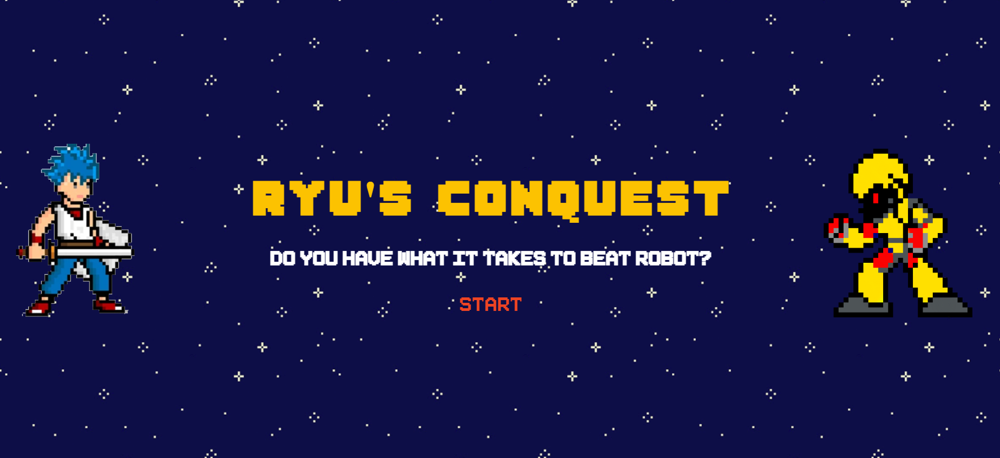

# Ryu's Conquest

## Inspiration
Once upon a time, a village is invaded by an extraterrestrial robot, Galatron. Upon leaving, he took away the most valuable things in the village, board games. While the inhabitants of the village are filled with sadness, a brave warrior named Ryu has decided to step up and go on a quest to bring back the games. To do that, he needs to beat Galatron in four famous board games on planet Xamos, Opus, Icrozar and Duex respectively. Let’s see if he can beat the robots! 

## What it does

Our protagonist Ryu has to go to the planets Opus, Duex, Xamos, and Icrozar to beat Galatron in Tic-Tac-Toe, Breakout, Connect 4, and Chess respectively in order to retrieve the stolen board games. 

## How we built it

The application has been designed using elementary tools of Web Development like HTML,CSS and JavaScript to design the Frontend. All the games have been developed using JavaScript and jQuery.

## Challenges we ran into

At first, we thought of having a single webpage that showed and hid the games we chose to play. This proved to be problematic due to numerous problems like overlapping variables.

## Accomplishments that we're proud of

We were successful in developing a Web Application and proud of bring our thoughts to reality. 

## What we learned

We got lot of exposure in Game Development using JavaScript

## Screenshots

<table>
  <tr>
    <th>Page</th>
    <th>Description</th>
  </tr>
  <tr>
    <td>Main Page</td>
    <td></td>
  </tr>
  <tr>
    <td>TicTacToe</td>
    <td></td>
  </tr>
  <tr>
    <td>BreakDown</td>
    <td></td>
  </tr>
  <tr>
    <td>Connect 4</td>
    <td></td>
  </tr>
  <tr>
    <td>Chess</td>
    <td></td>
  </tr>
</table>

## What's next for Ryu's Conquest

We believe that this Project possesses tremendous potential and can be taken forward. Time Clock can be added along with escalation in game difficulties. Also we need not restrict ourselves to only four planets and incorporate new games. 

## Tech Stack
<code></code>
<code></code>
<code></code>
